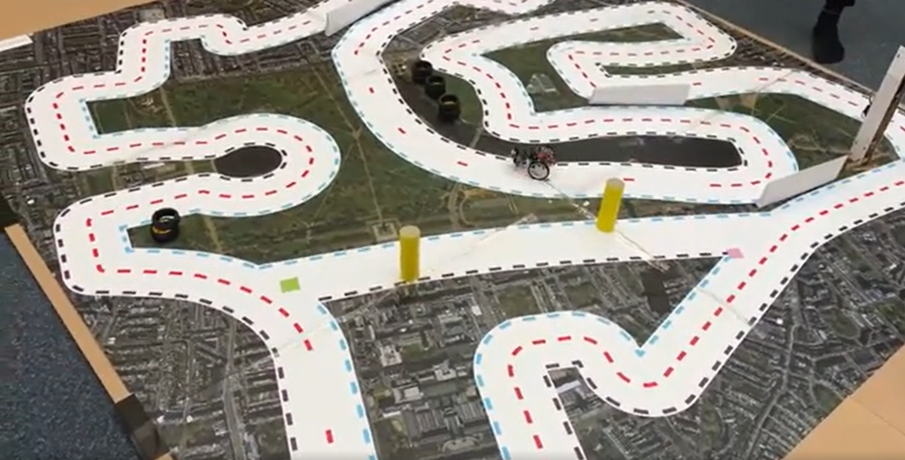

# PixyBot Car Race Challenge

This folder contains the scripts run during the PixyBot race on 20 April 2023.

[](https://youtu.be/mSpLFaTugbU)

## How to Use This Folder

1. Navigate to this folder on your Raspberry Pi.
2. Place the PixyBot on the race track.
3. Execute the race script with the following command:

```bash
sudo python3 race_run.py
```
---
## About the Scripts

### 1. `race_run.py`

- This is the actual script used during the robot race.
- It calls `control.py` to implement lane following.

### 2. `race_clean.py` and `follower.py`

- `race_clean.py` is a cleaner and commented version of `race_run.py`.
- `follower.py` is a cleaner and commented version of `control.py`.
- `race_clean.py` calls `follower.py` to implement lane following.
- **Note:** `race_clean.py` and `race_run.py` perform the same task.
- Likewise, `follower.py` and `control.py` do the same thing.

### 3. `Simplemultilanefollowing.py`

- A preliminary script containing "trial and error" code.
- Used during initial experimentation to develop the final race scripts.

### 4. Other Files

- All other files are dependencies used by:
  - `race_run.py`
  - `race_clean.py`
  - `control.py`
  - `follower.py`
